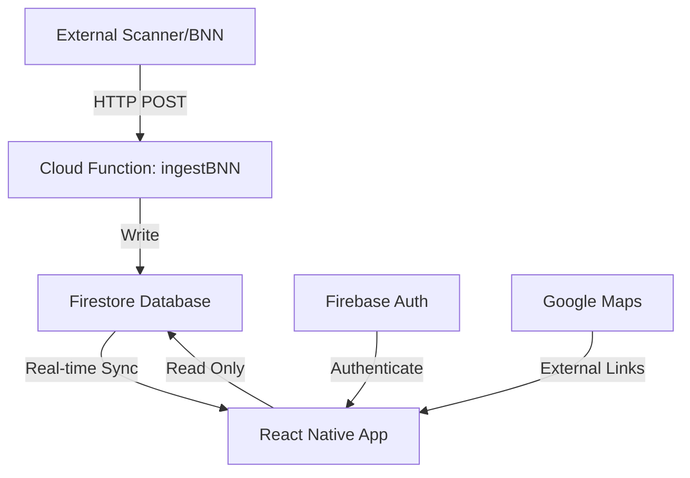

# EMU Alerts Architecture Documentation

## System Overview

EMU Alerts is a real-time emergency alert monitoring system built with React Native (Expo) and Firebase. The architecture follows a serverless, event-driven design with real-time data synchronization.



## Technology Stack

### Frontend (Mobile/Web App)
- **Framework**: React Native with Expo SDK 53
- **Language**: TypeScript 5.8.3
- **UI Navigation**: React Navigation 7.x
- **State Management**: React Hooks (useState, useEffect, custom hooks)
- **Platform Support**: iOS, Android, Web

### Backend Services
- **Database**: Firebase Firestore (NoSQL, real-time)
- **Authentication**: Firebase Auth (Email/Password)
- **Cloud Functions**: Firebase Functions (Node.js 18)
- **Hosting**: Firebase Hosting (for web deployment)

### Key Dependencies

```json
{
  "react": "19.0.0",
  "react-native": "0.79.6",
  "expo": "~53.0.22",
  "firebase": "^12.1.0",
  "@react-navigation/native": "^7.1.17",
  "@react-navigation/native-stack": "^7.3.25",
  "expo-location": "^18.1.6",
  "react-native-safe-area-context": "^5.6.1",
  "react-native-screens": "^4.15.2"
}
```

## Data Flow Architecture

### 1. Alert Ingestion Flow
```
External System → Cloud Function → Firestore → App
```

1. **External System** (e.g., Macrodroid, Scanner Feed)
   - Captures emergency dispatch data
   - Sends HTTP POST to cloud function

2. **Cloud Function** (ingestBNN)
   - Validates X-Ingest-Token
   - Processes and normalizes data
   - Creates/updates Firestore documents

3. **Firestore**
   - Stores alerts with timestamps
   - Maintains message history
   - Triggers real-time updates

4. **React Native App**
   - Subscribes to Firestore collections
   - Receives real-time updates
   - Displays alerts to users

### 2. User Authentication Flow
```
App → Firebase Auth → Firestore Security Rules
```

1. User enters credentials
2. Firebase Auth validates
3. Auth token attached to Firestore requests
4. Security rules enforce access control

## Project Structure

```
emu-alerts-expo/
├── App.tsx                    # Main app component & navigation setup
├── app.config.ts             # Expo configuration
├── index.ts                  # App entry point
├── src/
│   ├── components/           # Reusable UI components
│   │   ├── AlertFilters.tsx  # Search and filter functionality
│   │   ├── AlertItem.tsx     # Individual alert display
│   │   ├── LocationStatus.tsx # Location permission handler
│   │   └── MapView.tsx       # Google Maps integration
│   ├── firebase/
│   │   └── config.ts         # Firebase initialization
│   ├── hooks/                # Custom React hooks
│   │   ├── useAlerts.ts      # Alert data management
│   │   ├── useAuth.ts        # Authentication logic
│   │   ├── useIncidentDetails.ts # Detailed alert data
│   │   └── useLocation.ts    # Device location tracking
│   ├── screens/              # Screen components
│   │   ├── SignInScreen.tsx  # Authentication UI
│   │   ├── MainScreen.tsx    # Alert list view
│   │   └── AlertDetailsScreen.tsx # Alert details view
│   └── types/
│       └── Alert.ts          # TypeScript interfaces
├── functions/                # Cloud functions
│   ├── index.js             # ingestBNN function
│   └── package.json         # Function dependencies
├── android/                  # Android-specific code
├── assets/                   # Images and icons
└── docs/                     # Documentation
```

## Component Architecture

### Screen Components

```typescript
// Navigation Stack
<NavigationContainer>
  <Stack.Navigator>
    <Stack.Screen name="SignIn" component={SignInScreen} />
    <Stack.Screen name="Main" component={MainScreen} />
    <Stack.Screen name="AlertDetails" component={AlertDetailsScreen} />
  </Stack.Navigator>
</NavigationContainer>
```

### Custom Hooks Architecture

1. **useAuth**: Manages authentication state
   - Sign in/out functionality
   - User state persistence
   - Error handling

2. **useAlerts**: Handles alert data
   - Real-time Firestore subscription
   - Data transformation
   - Refresh capability

3. **useIncidentDetails**: Fetches detailed alert info
   - Messages subcollection
   - Grouped data presentation
   - Loading states

4. **useLocation**: Device location tracking
   - Permission management
   - Location updates
   - Distance calculations

## Database Schema

### Firestore Collections

```
firestore/
├── alerts/                   # Main alerts collection
│   ├── {alertId}/           # Individual alert document
│   │   ├── alertId
│   │   ├── state
│   │   ├── county
│   │   ├── city
│   │   ├── address
│   │   ├── geo: { latitude, longitude }
│   │   ├── alertType
│   │   ├── initialMessage
│   │   ├── createdAt
│   │   ├── lastUpdatedAt
│   │   └── messages/        # Subcollection
│   │       └── {messageId}/
│   │           ├── message
│   │           ├── receivedAtEpoch
│   │           └── serverTimestamp
```

## Security Architecture

### Authentication
- Firebase Auth with email/password
- Persistent sessions via Firebase SDK
- Automatic token refresh

### Authorization
```javascript
// Firestore Security Rules
match /alerts/{alertId} {
  allow read: if request.auth != null;
  allow write: if false; // Cloud functions only
}
```

### API Security
- Cloud functions protected by X-Ingest-Token
- CORS enabled for web compatibility
- Input validation and sanitization

## Performance Optimizations

### React Native
- FlatList with optimization props:
  - `maxToRenderPerBatch={10}`
  - `windowSize={10}`
  - `removeClippedSubviews={true}`
  - `getItemLayout` for known heights

### Firestore
- Query limits (`limit(200)`)
- Indexed queries on timestamps
- Real-time listeners with unsubscribe

### Bundle Size
- Expo's tree shaking
- Platform-specific code splitting
- Lazy loading for screens

## Deployment Architecture

### Web Deployment
```bash
expo export --platform web --output-dir dist-web
# Deploy to any static hosting (Netlify, Vercel, Firebase Hosting)
```

### Mobile Deployment
```bash
# EAS Build for production
eas build --platform android --profile production
eas build --platform ios --profile production
```

### Cloud Functions
```bash
firebase deploy --only functions:ingestBNN
```

## Monitoring and Logging

### Application Monitoring
- Firebase Crashlytics integration
- Console logging for development
- Error boundaries for crash prevention

### Cloud Function Monitoring
- Google Cloud Console logs
- Firebase Console function metrics
- Error tracking and alerts

## Scalability Considerations

### Current Limits
- Firestore: 1 write/second per document
- Cloud Functions: 1000 concurrent executions
- Real-time listeners: 100k simultaneous connections

### Scaling Strategy
1. **Horizontal**: Multiple cloud function instances
2. **Caching**: Local state management in app
3. **Pagination**: Implement if alerts exceed 1000s
4. **Regional deployment**: Multi-region Firestore

## Development Workflow

### Local Development
```bash
# Install dependencies
pnpm install

# Start development server
pnpm run web  # or android/ios

# Run cloud functions locally
firebase emulators:start --only functions
```

### Testing Strategy
- Unit tests for hooks and utilities
- Integration tests for Firebase operations
- E2E tests with Detox (future)

### CI/CD Pipeline (Recommended)
1. GitHub Actions for automated testing
2. EAS Build for mobile deployments
3. Firebase Hosting for web deployments
4. Automatic cloud function deployment

## Future Architecture Considerations

### Potential Enhancements
1. **Push Notifications**: Firebase Cloud Messaging
2. **Offline Support**: Firestore offline persistence
3. **Analytics**: Firebase Analytics integration
4. **Maps Enhancement**: Native map components
5. **Multi-tenancy**: Organization-based access control

### Performance Improvements
1. **Virtual scrolling**: For large alert lists
2. **Image caching**: For future media support
3. **Background sync**: For offline capability
4. **WebSocket alternative**: For higher frequency updates